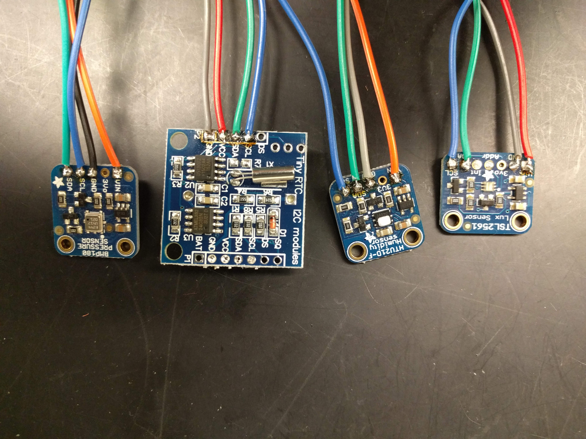
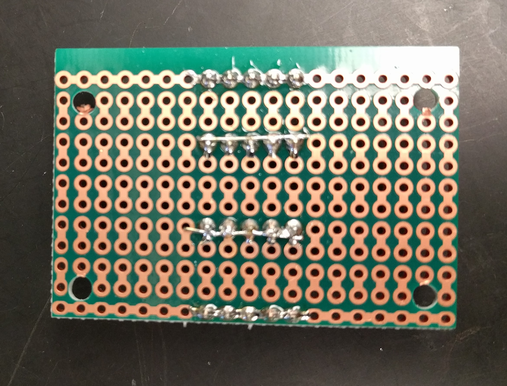
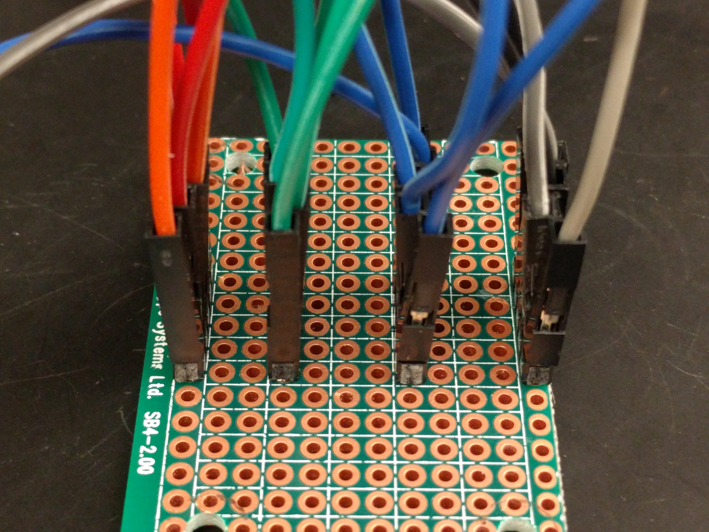
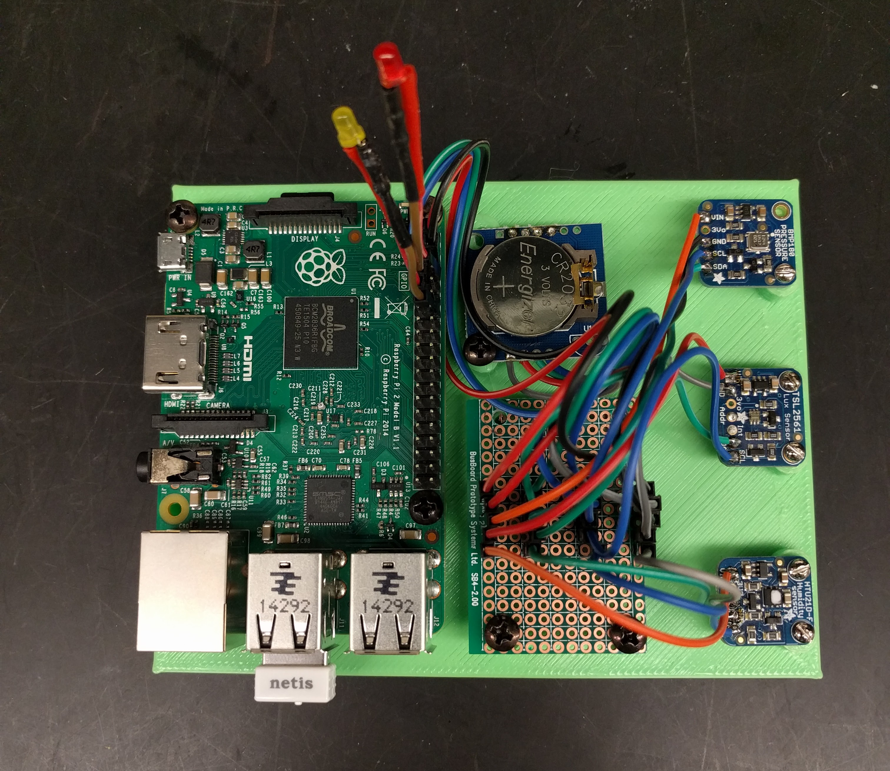

# Using the Raspberry Pi single board computer to monitor the lab environment

The sensor we use include the HTU21DF for humidity,  TSL2561 for light,  and BMP180 for barometric pressure. Both the HTU21DF and BMP180 have a temperature sensor. So we take the average readout of the two. These sensors are all connected to the Raspberry Pi via I2C.  We also use a I2C  real-time clock (DS1307 from either Adafruit or JBtek. JBtek is cheaper but some of the units we got were not reliable) to ensure the accuracy of the time.  

The location of the device is identified in a file named deviceid located at /home/pi/. The ID stored in this file is used to name the data file. This ID is also entered in the data file. This allows the same program to be deployed at multiple locations. The python logger program is run once every 10 min via cron.

We use this device to monitor the environment of animal housing rooms where the light cycle is reversed. The logger program  writes the lux level during the night to a file called lux.csv. The checklux.py program, also ran via a cron job, checks the lux level during the day and flashes an LED to alert the technician if lights are off during the night.    

## Parts list

Raspberry Pi 2B or 3  [Element 14] (https://www.element14.com/community/community/raspberry-pi)

TSL2561 Lux Sensor [Adafruit] (https://www.adafruit.com/products/439)

BMP180 Pressure Sensor [Adafruit] (https://www.adafruit.com/products/1603)

HTU21D-F Humidity Sensor [Adafruit] (https://www.adafruit.com/products/1899)

SB4 Snappable PC BreadBoard [Amazon] (https://www.amazon.com/gp/product/B00PX52C7Q)

1P-1P female to Female Jump Wire [Amazon] (https://www.amazon.com/gp/product/B00R96X8JS)

Edimax USB WiFi module, not needed if use RPi 3B [Amazon] (https://www.amazon.com/Edimax-EW-7811Un-150Mbps-Raspberry-Supports/dp/B003MTTJOY/)

## Assembly 

### Add wires to the sensors

Cut the jumb wire in half. Solder four wires to each sensor (and RTC). We use black (or grey) for ground, red (or orange) for 5V, blue for SCL, and green for SDA. 


### Prepare the breadboard
Drill four holds at the corners. Solder four rows of pin heads (five pins each) to the snappable breadboard. 
We use the two side rows for the GND and 5V. Use the middle two rows for SDA and SCL. 
.

Make sure pins on the same head are all connected at the back. (You can solder a short segment of wire to two middle pin heads to connect them).  
.

### Connect the wires

Connect the sensors and the real-time clock to the pins.


Use one additional sets of four wires to connect the last set of pins to the GND, 5V, SCL, and SDA pins on the RPi.

### Final step

Screw the parts to the 3D printed base.


## Software

Clone the repository
```
cd /home/pi/
git clone https://github.com/chen42/openbehavior.git
```

Enable the realtime clock by following these [instructions](https://learn.adafruit.com/adding-a-real-time-clock-to-raspberry-pi/overview)

Edit the /etc/rc.local file to include the following lines  (needed by the RTC and HTU21D-F sensor library)

```
echo ds1307 0x68 > /sys/class/i2c-adapter/i2c-1/new_device
pigpiod &
```

Run the following command to edit cron 

```
sudo crontab -e
```

Add the following line will run the EnvSensor script once every 20 min.

``` 
*/20 * * * python /home/pi/openbehavior/envSensors/env_logger.cron.py 
```


