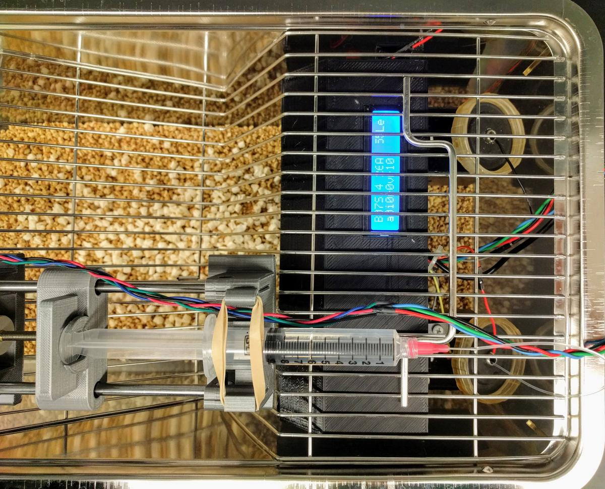

# Operant Licking

This device uses a RPi to record the licking events on two spouts. It then drives a syring pump to deliver a fixed amount of liquid to the spout, based on the reinforcement schedule in effect (fixed, variable, or progressive ratio).  

## [Parts list](PartsList.md) 

## [Assembly instruction](Assembly.md)

Detailed description is published in this [PeerJ Article](https://peerj.com/articles/2981/)

A video of rat licking for sucrose under a VR10 schedule is available [here](https://youtu.be/l3SEo6oAtPM)
