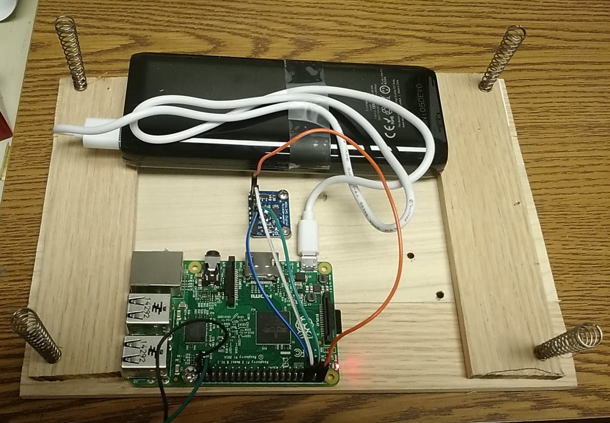

#Ratremor

Tremor is a common sign of withdrawal from abused drugs. By fixing an ADXL345 accelerometer to the bottom of a platform that is sitting on a set of four balanced springs, we are testing if the z-axis data can be used to measure tremor in rats.

