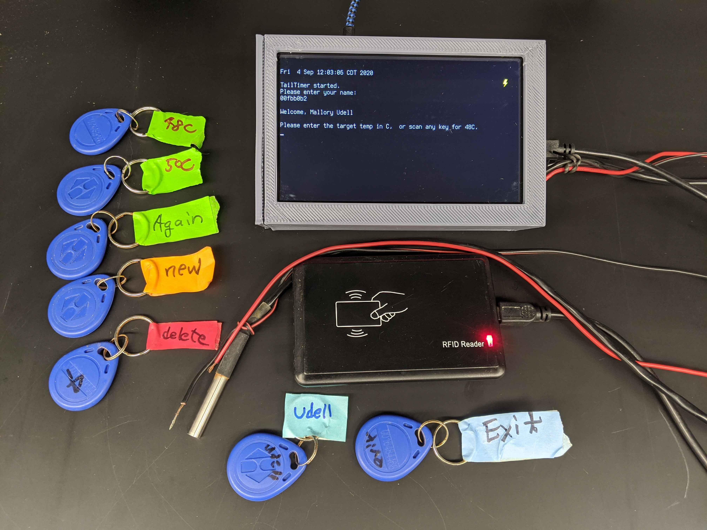

# TailTimer: Automating the tail immersion assay 

The tail immersion assay is a widely used method for measuring acute thermal pain in rodents. TailTimer  uses the Raspberry Pi computer to automatically record both tail withdrawal latency and water temperature. The device has a radio frequency identification (RFID) system that can record the ID of animals. The software recognizes several specific RFID keys as user interface commands, which allows TailTimer to be operated via RFID fobs. We also programmed the device to only allow tests to be conducted when the water is within ± 0.25 °C of the target temperature.



### Materials needed 
* One  Raspberry Pi 3 (Model B, RaspberryPi Foundation, UK) 
* One 5-inch touch screen (DFR0550, DFRobot, Shanghai, China)
* One a waterproof digital temperature sensor (DS18B20, Adafruit Industries, NY, USA)
* One USB RFID reader (EM4100, 125 kHz, HiTag, available at Amazon.com)
* EM4100 RFID fobs (available from Amazon.com)
* Two electrical wires.
### Connections
* The ground wire is connected to one of the ground pins of the general purpose input/output (GPIO)
* The latency wire is connected to GPIO 18 (pin 12). 
* The temperature sensor connects via a 1-wire serial interface to provide continuous temperature readings. 
* The RFID reader connects to the RP3 via a USB port. 
### Setting up the raspberry pi

To use TailTimer on Raspberry Pi, first enable 1-wire by add the following lines to /boot/config.txt

```
# for external temp probe
dtoverlay=w1-gpio
dtoverlay=pi3-disable-bt

```
You also need to enable serial, password-less login, and disable graphical interface by first running the following command 

```
$ sudo raspi-config
``` 
and select appropriate options. 


Then clone this repo. 

```
git clone github.com/chen42/openbehavior
```

To run the program automatically after boot, add the following line to the .bashrc file of the user pi (adjust the path accordingly):


```
runtailtimer.sh
```


### Usage
During operation, the ground wire and thermal probe remain immersed together in the hot water at approximately 50% of the depth. The latency wire is dipped into the hot water at the same time as a rat’s tail and is taken out of the hot water, together with the tail, when a pain response is observed (i.e., the tail starts to “flick” in response to heat). Data will be automatically copied to a connected USB storage device upon exiting the program. 

